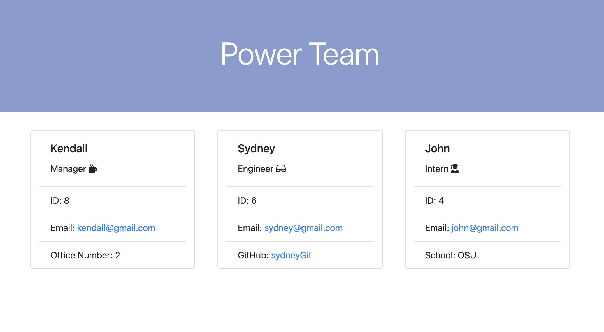
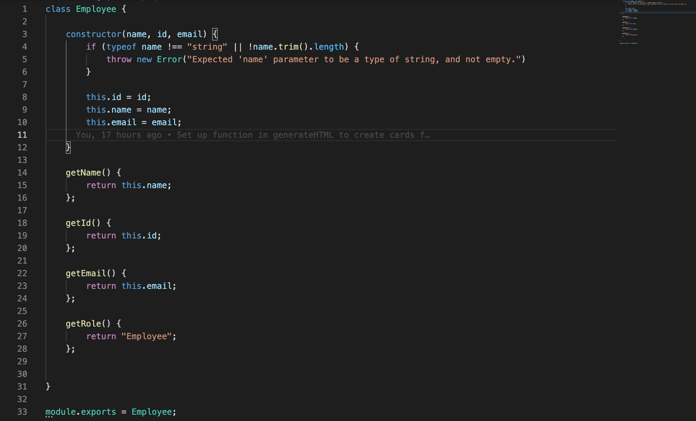
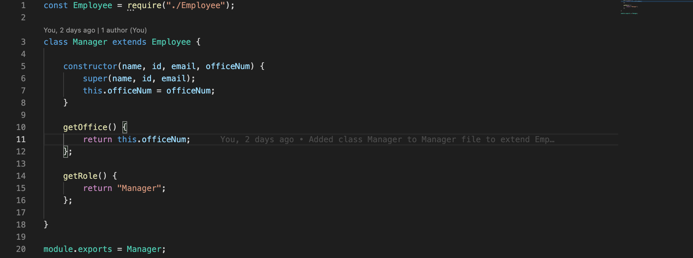
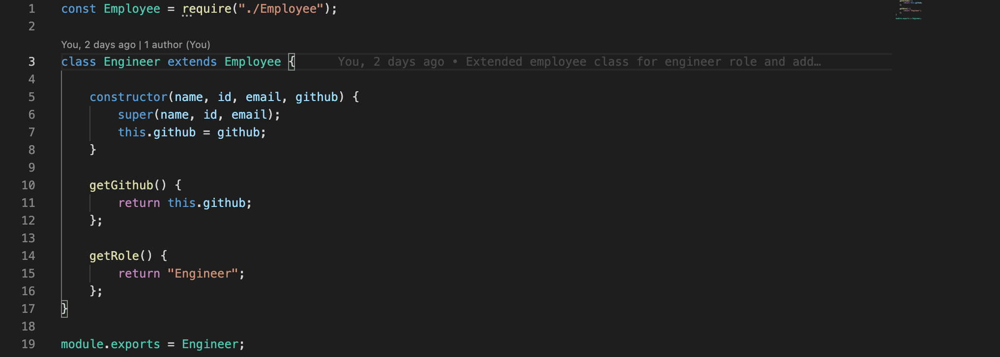
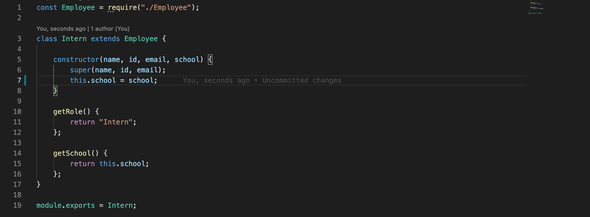
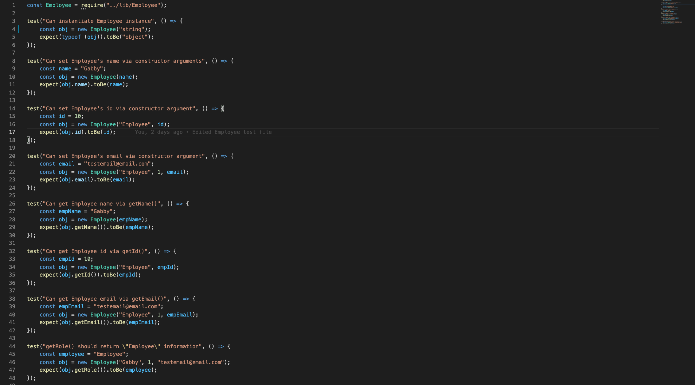
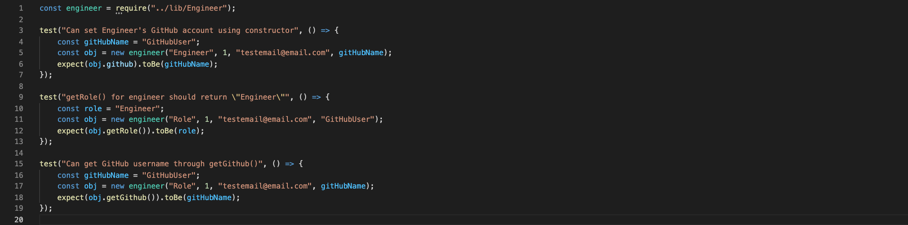
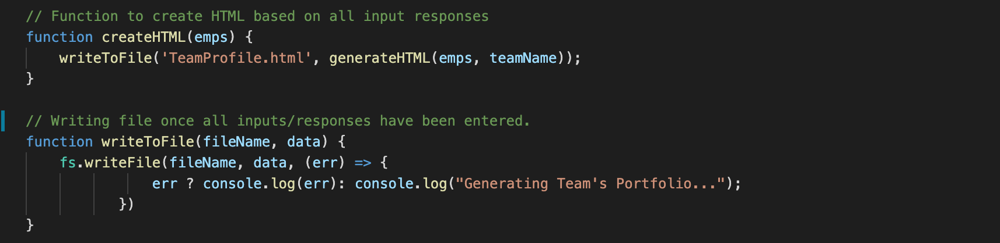
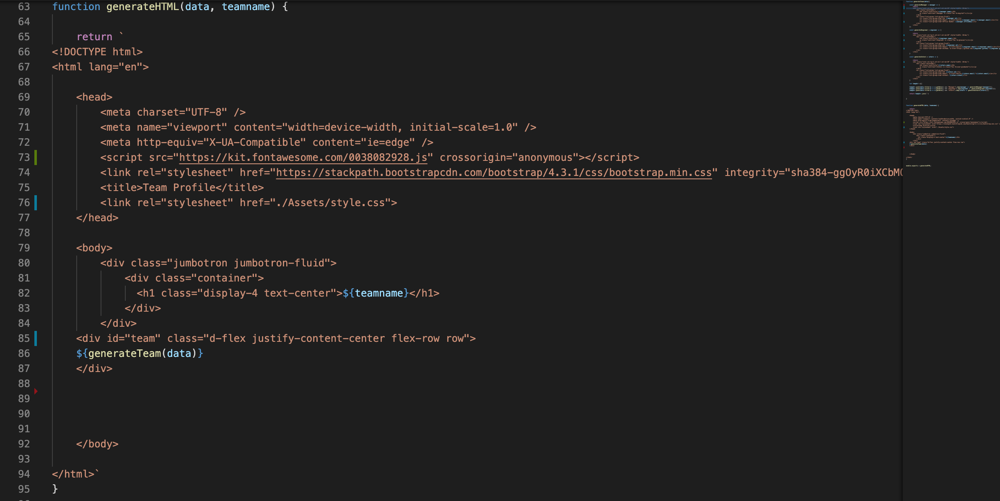
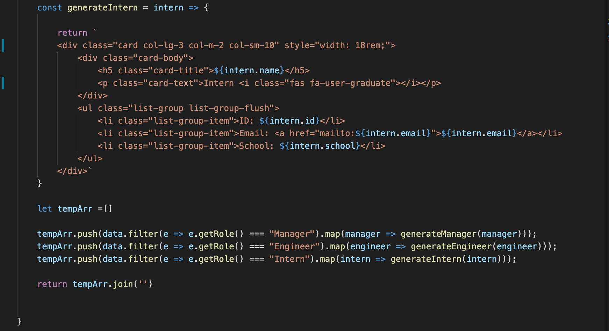

# Team-Profile-Generator

This application is a profile/webpage generator for a team of engineering employees utilizing Node.js command lines and jest for testing purposes.

## User Story

```md
AS A manager
I WANT to generate a webpage that displays my team's basic info
SO THAT I have quick access to their emails and GitHub profiles
```

## Acceptance Criteria

```md
GIVEN a command-line application that accepts user input
WHEN I am prompted for my team members and their information
THEN an HTML file is generated that displays a nicely formatted team roster based on user input
WHEN I click on an email address in the HTML
THEN my default email program opens and populates the TO field of the email with the address
WHEN I click on the GitHub username
THEN that GitHub profile opens in a new tab
WHEN I start the application
THEN I am prompted to enter the team manager’s name, employee ID, email address, and office number
WHEN I enter the team manager’s name, employee ID, email address, and office number
THEN I am presented with a menu with the option to add an engineer or an intern or to finish building my team
WHEN I select the engineer option
THEN I am prompted to enter the engineer’s name, ID, email, and GitHub username, and I am taken back to the menu
WHEN I select the intern option
THEN I am prompted to enter the intern’s name, ID, email, and school, and I am taken back to the menu
WHEN I decide to finish building my team
THEN I exit the application, and the HTML is generated
```

## Mock-Up

The following image shows a mock-up of the generated HTML’s appearance and functionality:



## Development

This application includes `Employee`, `Manager`, `Engineer`, and `Intern` classes.

The first class is an `Employee` parent class with the following properties and methods:

* `name`

* `id`

* `email`

* `getName()`

* `getId()`

* `getEmail()`

* `getRole()`&mdash;returns `'Employee'`



The other three classes extend `Employee`.

In addition to `Employee`'s properties and methods, `Manager` also has the following:

* `officeNumber`

* `getRole()`&mdash;overridden to return `'Manager'`



In addition to `Employee`'s properties and methods, `Engineer` also has the following:

* `github`&mdash;GitHub username

* `getGithub()`

* `getRole()`&mdash;overridden to return `'Engineer'`



In addition to `Employee`'s properties and methods, `Intern` also has the following:

* `school`

* `getSchool()`

* `getRole()`&mdash;overridden to return `'Intern'`



We then have four different test files in order to test the user input responses. The main test is the Employee test as shown below:



From here, the individual Manager, Intern, and Engineer tests all look pretty similar where we test for specific input properties of each employee type (unique for each type) and also return their role and unique properties. Below is an example of the Engineer test:



In order to run the tests to ensure each test passes, the following command is invoked in the command line:

```bash
npm run test
```

From here, the main index.js file can be created. Here, we create two different question arrays, one for the Manager and one for the employee type/question prompts. We then have functions that utilize inquirer.prompt to have the prompts display in the terminal after invoking the following command:

```bash
node index.js
```

This command will then prompt the user with the specific quesitons, strting with the Manager's questions, and then moving on to the Employee questions for however many employees the manager wants to add.

Each employee input will be stored into an Employee Array so that the responses can then be used to generate the HTML page. We then take these responses and writetoFile:



We then created a separate generateHTML.js file to handle actually writing the HTML document based on the responses. Below we can see the function generateHTML which lays out the basic structure of the HTML page:



In this function, we can see that GenerateTeam is called and data is passed into it. Then within the generateTeam function, we create a template array called tempArray and push into it (by filtering through the specific role of the employee) the employee that was entered along with the individuals information. From here, we map over the array and call the specific variable that is responsible for actually generating that employee's card to be displayed on teh final page. See below for how this looks for an Employee of Intern:



This allows us to create a card for each employee that was added, including the manager, and displaying a card onto the page each time.

## Credits

Inquirer - [Inquirer](https://www.npmjs.com/package/inquirer)

Jest - [Jest](https://www.npmjs.com/package/jest)

## Links

GitHub Repository - [Team Profile Generator Repository](https://github.com/ktrudickm/Team-Profile-Generator "Team Profile Generator Repository")

Deployed Project - [Deployed Application](https://ktrudickm.github.io/Team-Profile-Generator/ "Deployed Application")